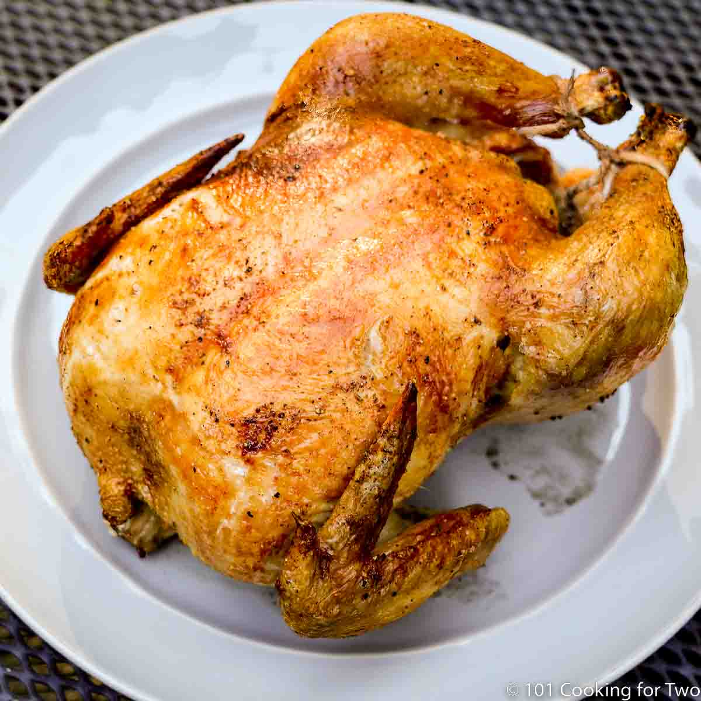

# maxymeats4meatlovers
Quality Meats retail
<!DOCTYPE html>
<html lang="en">
<head>
  <meta charset="UTF-8">
  <meta name="viewport" content="width=device-width, initial-scale=1.0">
  <title>Maxy Meats 4 Meat lovers</title>
  
</head>
<body>
  <header>
    <h1>Maxy Meats For Meat lovers</h1>
    
Fresh • Quality • Affordable

  </header>

  <nav>
    <a href="#about">About</a>
    <a href="#products">Products</a>
    <a href="#contact">Contact</a>
  </nav>

  

    <h2>About Us</h2>
    
At Maxy Meats, we provide the freshest and best quality meat products for our valued customers.  
       Whether it’s beef, chicken, pork, or goat, we deliver with care and passion.

  

  

    <h2>Our Products</h2>
    
🐄 Beef • 🐖 Pork • 🐐 Goat • 🐓 Chicken

    
Wholesale & Retail Available

  

 </section>  <section id="gallery">
    <h2>Image Gallery</h2>
    

      
      
      
    

  </section>  <section id="videos">
  

    <h3>Contact Us</h3>
    
📞 Phone: +263 77 000 1111

    
📍 Location: Harare, Zimbabwe

    

      <a href="https://www.facebook.com/MaxyMeats" target="_blank">Facebook</a>
      <a href="mailto:maxymeats@gmail.com">Email</a>
    

  

  <footer>
    
&copy; 2025 Maxy Meats | Designed with ❤️ in Brown & Orange

  </footer>
</body>
</html>
